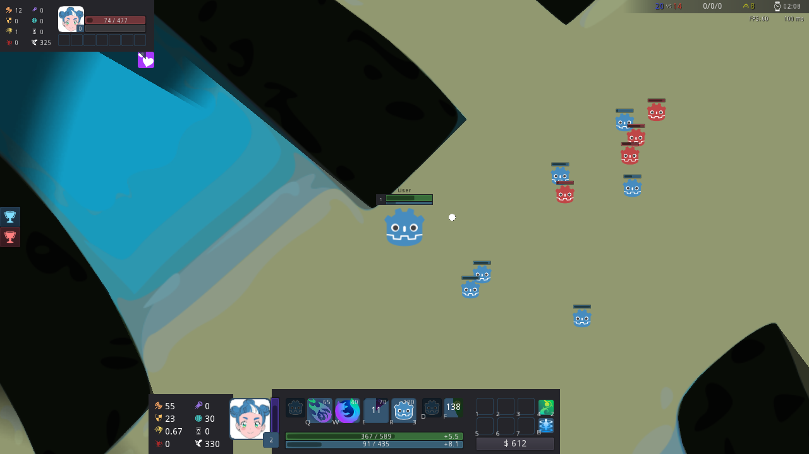

# League of Local Area Network

Для запуска игры [скачайте](https://godotengine.org/download) последнюю версию GodotEngine 3 (или используйте версию представленную в репозитории) и запустите в папке с игрой. При запуске вне оной откроется редактор, импортировав в который `project.godot` можно будет продолжить разработку.